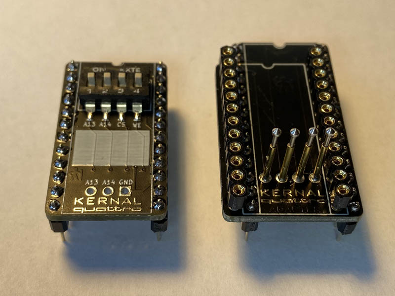

# KERNALquattro

The KERNALquattro is a compact, versatile, and still relatively cheap replacement for 2364 ROMs as found in the Commodore 64 and other 8-bit computers of that time. It provides 32KB of memory using an ATHC256 EEPROM, thus holding the equivalent of up to four 2364 ROMs. Those four banks can be selected using a DIP switch, solder bridges, or by external means using the connector.

An adapter board is provided which maps the pins of the KERNALquattro back to a 28C256 DIP EEPROM. This allows the EEPROM to be programmed using a standard programmer like the TL866.

See my [blog post](https://www.hackup.net/2022/05/the-kernal-quattro-a-2364-rom-replacement/) for more details.

 **USE AT YOUR OWN RISK!**.

## License

This work is licensed under a
[Creative Commons Attribution-NonCommercial-ShareAlike 4.0 International License](http://creativecommons.org/licenses/by-nc-sa/4.0/).
